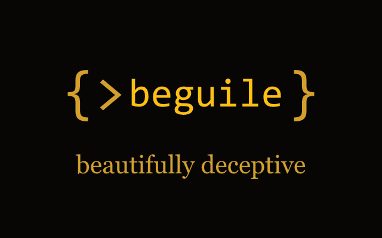

# Beguilex — Beguile Language Extension for VS Code



First some context:

***Beguile*** is a clean, type-aware language inspired by C++, C#, and TypeScript.  You can use it to create Z-Machine and Glulx story files.

***Beguiler*** is the *Beguile compiler* which you can find in the [Beguiler repo](https://github.com/onyxring/beguiler).  It transpiles *Beguile* source into I6 and instruments the [Inform 6](https://github.com/DavidKinder/Inform6) compiler. Install it for this extension to make use of.

***Beguilex*** is the *Beguile extension* for VS Code.  It provides syntax highlighting, diagnostics, hover, completion, embedded interpreters, run-time debugging support, and instruments the [Inform 6](https://github.com/DavidKinder/Inform6) compiler.  Without Beguiler, this extension has limited use.

## Status: Preview

This is an experimental preview. The language and compiler are evolving rapidly and this extension will change as a result. Feedback and bug reports are welcome via [GitHub Issues](https://github.com/onyxring/beguilex/issues).

## Editor

- Syntax and semantic highlighting
- Autocomplete, hover info, signature help, and go-to-definition
- Bracket matching, auto-close, and auto-indentation

## Build & Run

Compile and play .bgl games directly in VS Code using an embedded interpreter panel. Run **Beguile: Play** or **Beguile: Debug** from the Command Palette.

## Debugger

- Breakpoints in .bgl, .inf, and .h source files
- Step over, step into, and step out — at both Beguile and Inform 6 levels
- Step into included I6 library source (parser.h, verblib.h, etc.)
- Locals, globals, and self-property inspection with type-aware object expansion
- Watch expressions, call stack, and runtime variable editing

## Install

Download the latest `.vsix` from [Releases](https://github.com/onyxring/beguilex/releases), then:

```sh
code --install-extension beguile-language-0.1.0-preview.1.vsix
```

Or in VS Code: **Extensions** view → `⋯` menu → **Install from VSIX...**

## Requirements

- [beguiler](https://github.com/onyxring/beguiler) — the Beguile-to-Inform 6 transpiler. Download a binary from its [Releases](https://github.com/onyxring/beguiler/releases) and configure the path in extension settings (or ensure it's on your `PATH`).
- Inform 6 compiler [Inform 6](https://github.com/DavidKinder/Inform6) (invoked automatically by beguiler)

## Build from source

```sh
npm ci
npm run compile
npx vsce package
```

## Makes use of...

Beguilex uses the two node_modules for [quixe](https://github.com/choas/quixejs) and [ifvms](https://github.com/curiousdannii/ifvms.js).  These are javascript interpreters for Z-machine and Glulx games. 

## License

MIT — see [LICENSE](LICENSE).

## Use of AI

I've been writing code for nearly 50 years (since my TRS-80 model I), but this AI-assisted coding thing is new (as I write this) and I wanted to explore it.  Beguile - including the compiler (Beguiler) and the extension (Beguilex) - is my first exploration into what Claude Code is capable of.  I used it to different degrees with each project.
